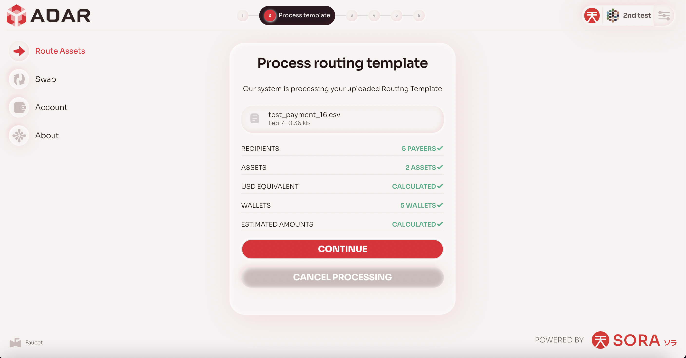
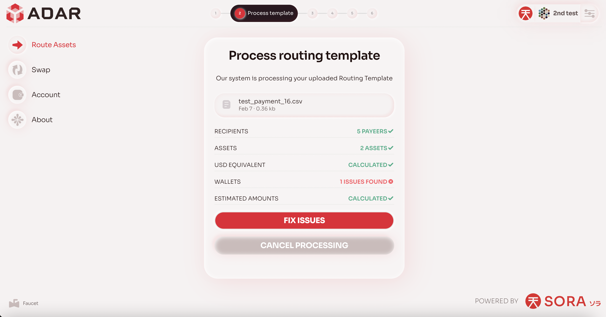
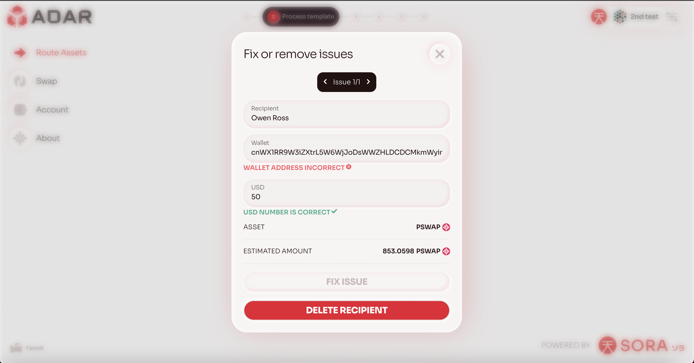
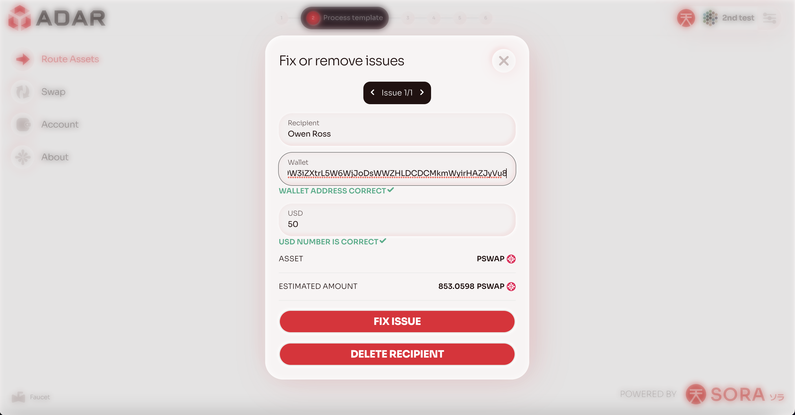
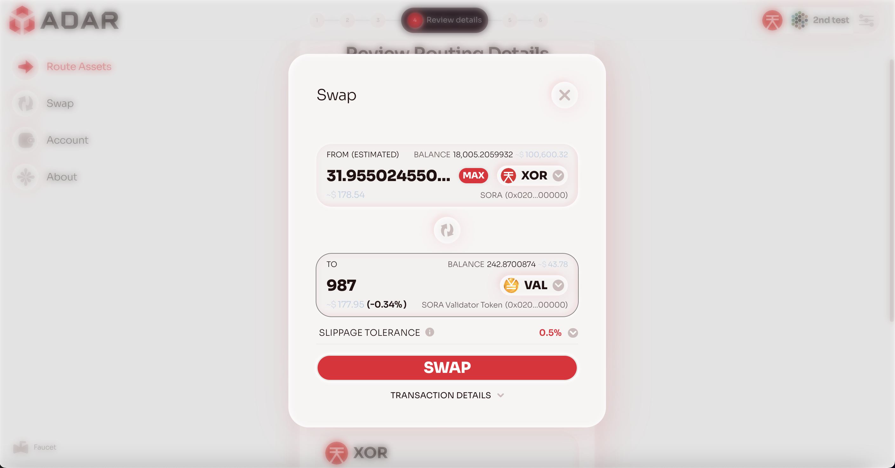
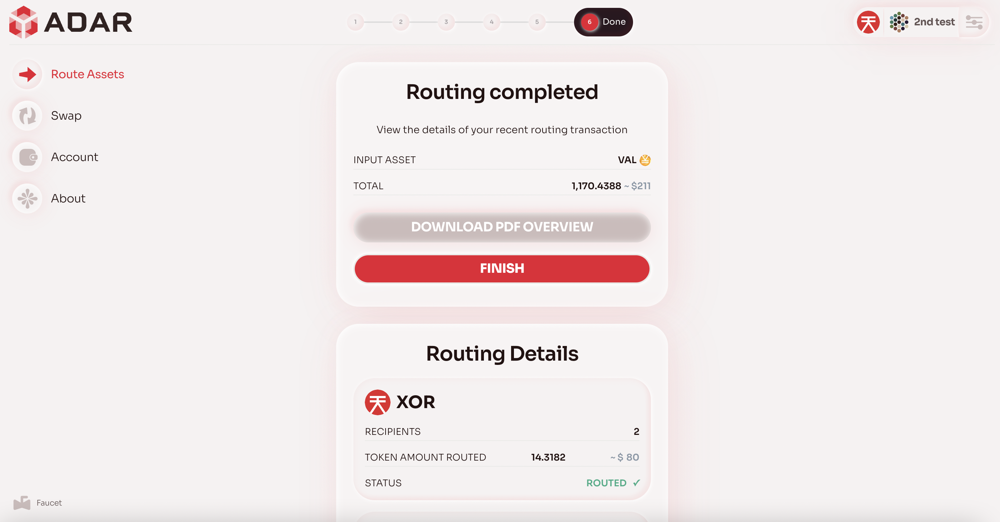

Welcome to ADAR (Advanced Digital Asset Routing) - a unique solution for businesses to seamlessly transmit digital assets to payees around the world in multiple currencies, at a fraction of today’s prevailing transaction costs, and without excessive paperwork and settlement times. In this guide, we will provide an overview of the main ADAR user cases, describing each stage in detail.

> 📝 In this guide, we will use a test environment - all links inserted further will only point to test components.

**Step 1.** Proceed to the [ADAR Testnet](https://testnet.adar.com)

**Step 2.** Connect your wallet

[Wallet Connection Walkthrough](./assets/connect_wallet.mov)

ADAR  is based on the SORA blockchain, proceed to the [SORA website](https://sora.org) to read more. This means that you need to use wallets compatible with the SORA network to explore ADAR.

The demo example will use the `polkadot.js` extension. To install the extension and read the documentation, please visit the [Polkadot.JS website](https://polkadot.js.org/extension/).

Once the wallet is successfully connected, you will see a corresponding address on the top right corner.

**Step 3.** Top up your SORA address using the faucet

[Faucet Walkthrough](./assets/faucet.mov)

> 📝 This stage is relevant only for the test environment

*Step 3.1.* Proceed to https://testfaucet.polkaswap.io/

*Step 3.2.* Enter your wallet address and the amount to be topped up

*Step 3.3.* Execute the faucet

*Step 3.4.* Check your wallet balance on the [ADAR platform](https://testnet.adar.com/#/wallet) to verify if the faucet transaction was successful

*Step 3.5.* 🟢 Once you have received the funds, you may continue exploring ADAR functions

**Step 4.** Route the assets

[Asset Routing Walkthrough](./assets/main_flow.mp4)

*Step 3.1.* Proceed to the [asset routing page](https://testnet.adar.com/#/route-assets)

*Step 3.2.* Upload a routing configuration (`.csv` file). On this page you will be able to find the template. Once you upload the file, ADAR will validate it. We have provided an [example template](./assets/template.csv). You are welcome to modify this template or create your own. However, please note that our application does not support multiple transactions to the same wallet in the template. Please ensure that you do not use one wallet twice, as we expect salaries to be distributed as usual.

Step 3.2.1. If there are configuration issues, ADAR will concisely indicate them, so that you can edit the `csv` file and subsequently re-upload it

*Step 3.3.* Select an input asset

As part of the current version, ADAR can use only one source asset and any number of target assets for a batch transfer of funds. This means that if the user specified `PSWAP` as the receiving asset, and `XOR` was selected as the source asset, then `XOR` will first be converted to `PSWAP` and then sent.

*Step 3.4.* Confirm the transaction

*Step 3.5.* Sign the transactions

Within the current implementation, several transactions will need to be signed in the case where asset coversion is needed before transfering the assets. In any case, it will always be done within the web extension (ie Polkadot.js).

*Step 3.6.* Wait until the transaction is included in the blockchain. Once the transactions are executed successfully, ADAR will display the corresponding statuses on a web page

Step 3.6.1. If there were problems with the batch transfers, you will see the corresponding errors, and you can immediately retry the transfer within the UI

*Step 3.7.* Download an automatically generated PDF file

🎉 Congratulations! You have completed a batch asset transfer using ADAR.
