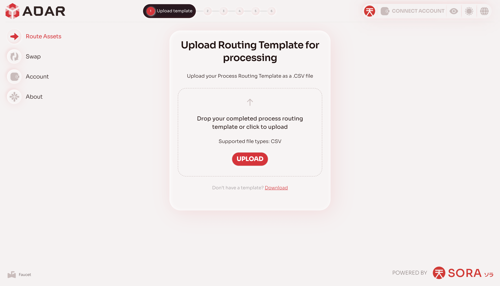
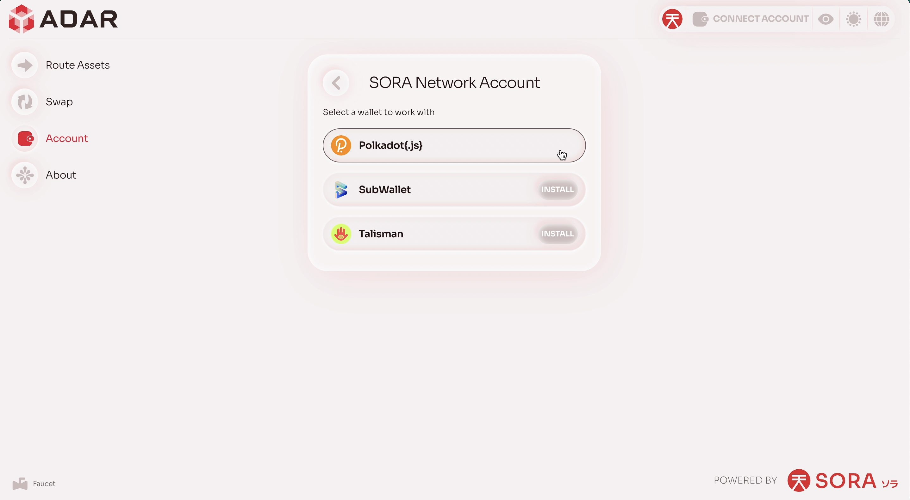
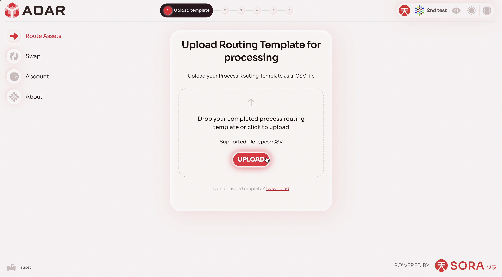
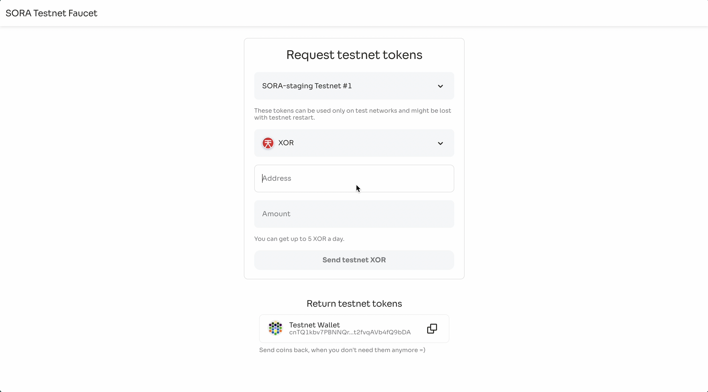
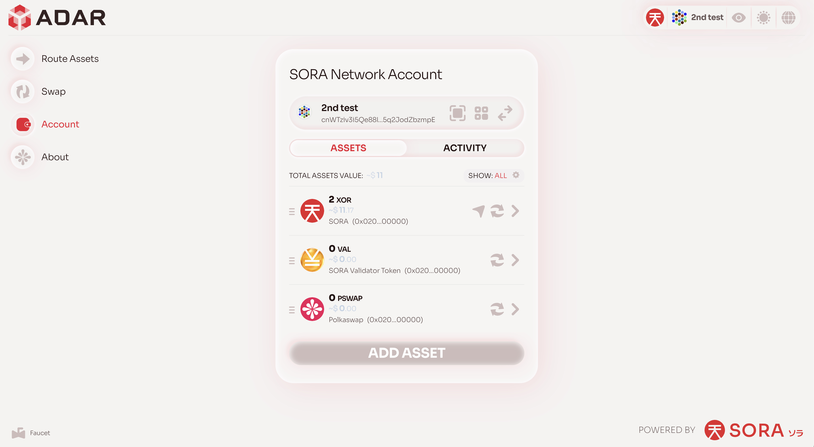
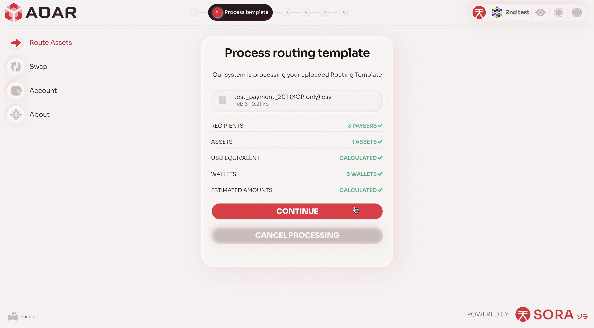
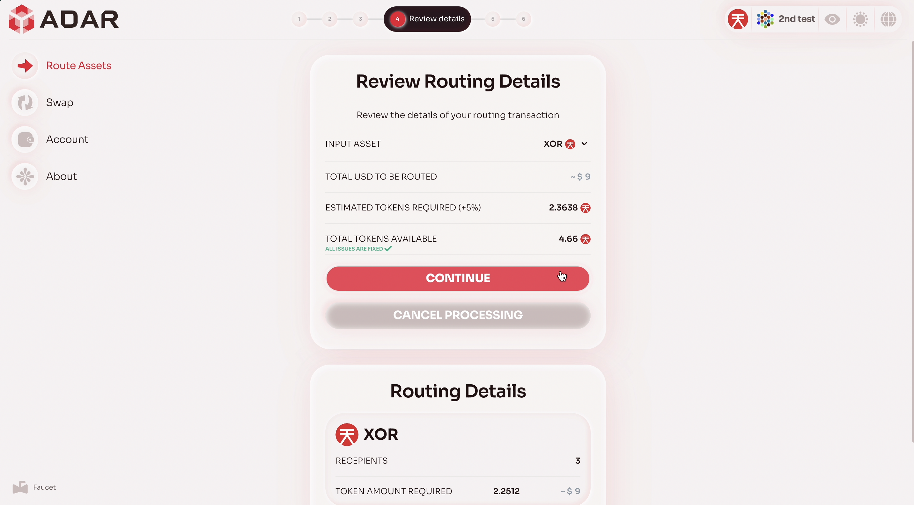
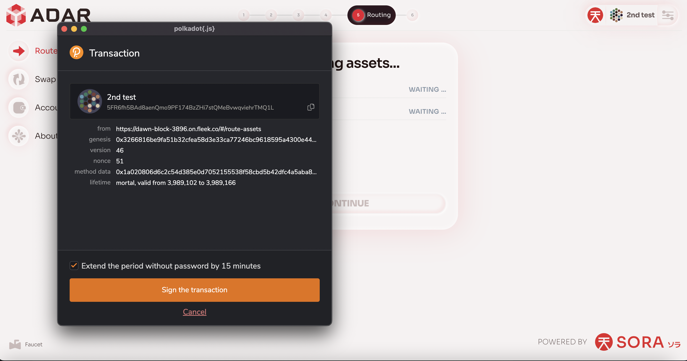
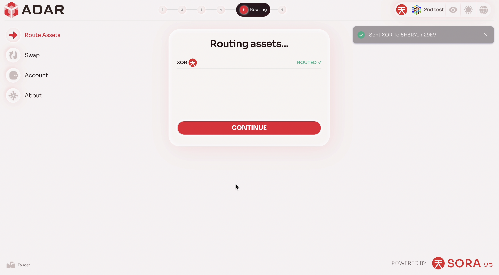
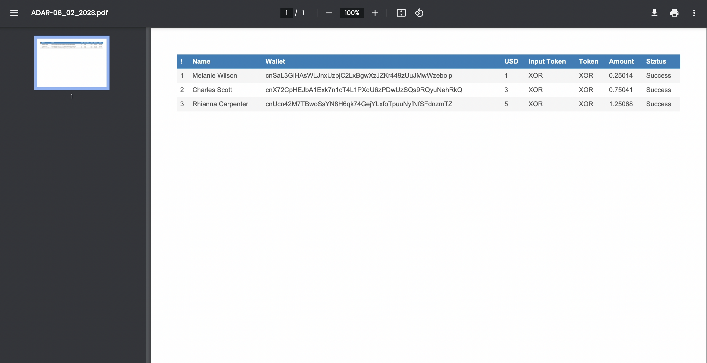

Welcome to ADAR (Advanced Digital Asset Routing) - a unique solution for businesses to seamlessly transmit digital assets to payees around the world, in multiple currencies, at a fraction of today’s prevailing transaction costs, without excessive paperwork and settlement times. In this guide, we will go through all the main ADAR user cases, describing each stage in detail.

> 📝 In this guide, we will use a test environment - all links inserted further will point exactly to the test components.

**Step 1.** Proceed to a https://testnet.adar.com

**Step 2.** Connect your wallet

[Walkthrough](./assets/connect_wallet.mov)

As you know, ADAR  is based on the SORA blockchain. To read more about SORA blockchain, please proceed to https://sora.org. This means that you need to use wallets compatible with the network to explore ADAR.

The demo example will use the `polkadot.js` extension. To install the extension and read the documentation, please visit https://polkadot.js.org/extension/.

Once the wallet is successfully connected, you will see a corresponding address on the top right corner.

**Step 3.** Top up your SORA address using faucet

[Walkthrough](./assets/faucet.mov)

> 📝 This stage is relevant only for the test environment

*Step 3.1.* Proceed to https://testfaucet.polkaswap.io/

*Step 3.2.* Enter the address of your wallet and the amount to be topped up

*Step 3.3.* Execute the faucet

*Step 3.4.* Check your wallet balance on https://testnet.adar.com/#/wallet to see, whether faucet transaction successfully worked

*Step 3.5.* 🟢 Once you have received the funds, you may continue exploring the ADAR functionality

**Step 4.** Route the assets

[Walkthrough](./assets/main_flow.mov)

*Step 3.1.* Proceed to https://testnet.adar.com/#/route-assets

*Step 3.2.* Upload a routing configuration (`.csv` file). On this page you will be able to find the template. Once you upload the file, ADAR will perform it's avlidation

Step 3.2.1. If there are issues with the configuration, ADAR will indicate them in the consice form so that you can edit a `csv` file and consequently re-upload it

*Step 3.3.* Select an input asset

As part of the current version, ADAR can use only one source asset and any number of target assets for batch transfer of funds. This means that if the user specified `PSWAP` to receive, and `XOR` was selected as the source asset, then `XOR` will first be automatically converted to `PSWAP` and then sent.

*Step 3.4.* Confirm the transaction

*Step 3.5.* Sign the transactions

In case when before transfering the assets a conversion will have to be done, within the current implementation you will need to sign several transactions. In any case, it will always be done within a web extension.

*Step 3.6.* Wait until the transaction is included in the blockchain. Once the transactions are executed successfully, ADAR will display the corresponding statuses on a web page

Step 3.6.1. If there were problems with batch transfers, you will see the corresponding errors and you can immediately try to make the transfer again within the UI

*Step 3.7.* Download an automatically generated PDF file

🎉 Congratulations! You have completed the batch asset transferring using ADAR.